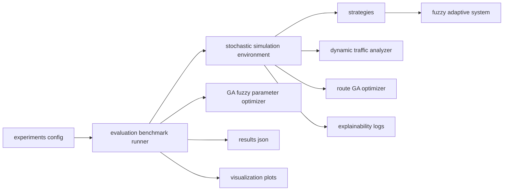

# Research Track: Hybrid Adaptive Intelligent Elevator System

This directory contains a research-grade modular architecture for adaptive soft-computing elevator control under uncertainty.

## Architecture



## Problem Definition

Dispatch and routing are optimized under uncertainty with objective:

`fitness = -(avg_wait + alpha*energy + beta*variance + gamma*overload_penalty)`

## Run

From project root:

```bash
python research/run_research_demo.py
```

## Modules

- core/: shared contracts and experiment config
- fuzzy/: adaptive fuzzy inference and explainability
- ga/: fuzzy parameter optimization
- simulation/: stochastic constraints and dynamics
- strategies/: baselines + hybrid strategy
- evaluation/: controlled benchmarking
- visualization/: convergence and comparison plots

## Output

- benchmark_results.json with per-scenario per-strategy metrics
- embedded explainability traces (memberships, rule activations, scores)
- ga_convergence.png
- wait_comparison.png
- fairness_comparison.png
- traffic_heatmap_wait.png
